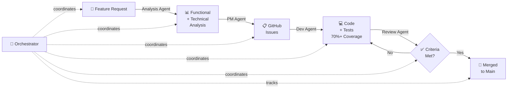

# Ticketing Engine

Cloud-scale event ticketing engine for high-concurrency reservation workflows.

This project is being built as a portfolio-grade system. The focus is not just on feature delivery, but on showing disciplined engineering around correctness, fairness, resilience, clean architecture, and explicit system design tradeoffs.

## What the system does

The platform manages concert event seat inventory under contention and is designed to:

- reserve seats without overbooking
- keep reservation flows responsive under load
- release expired holds automatically
- preserve a clear audit trail of reservation lifecycle behavior
- support future scaling into read/write separation and event-driven processing

## 🤖 AI-Powered Multi-Agent Architecture

The ticketing-engine demonstrates a **production-grade reservation system** with **autonomous multi-agent orchestration** for the complete development lifecycle:

### Multi-Agent Development Workflow

The project uses an AI-assisted development approach where:

- **Analysis Agent** → Decomposes feature requirements into functional + technical analysis
- **PM Agent** → Converts analysis into structured GitHub Issues with acceptance criteria
- **Development Agent** → Implements issues with 70%+ test coverage, creates Pull Requests
- **Review Agent** → Verifies all acceptance criteria are met, approves or requests changes
- **Orchestrator Agent** → Coordinates all agents, tracks progress, escalates blockers

### Workflow Diagram



### How It Works

1. **Analysis Phase** → Agent analyzes requirements and creates detailed analysis documents
2. **Planning Phase** → PM Agent converts analysis to GitHub Issues with clear acceptance criteria
3. **Development Phase** → Dev Agent implements issues with comprehensive testing
4. **Review Phase** → Review Agent verifies all acceptance criteria and approves code
5. **Integration** → Approved PRs merged to main automatically

### Agent Framework Documentation

See `.github/README.md` for complete agent framework with:
- Detailed agent definitions and responsibilities
- Copilot instructions for each agent
- Handoff protocols between agents
- Real-world workflow examples

## Current state

The repository already demonstrates the core backbone of the ticketing flow:

- API layer with a versioned reservation endpoint using query-string versioning
- application layer with command-oriented reservation flow contracts
- domain layer with the `ConcertEvent` aggregate and seat lifecycle rules
- infrastructure layer with MongoDB persistence, Kafka publishing, and a background expiration worker
- automated tests covering controller contract behavior, reservation flow behavior, and persistence-related transitions

## Architecture snapshot

The current design follows Clean Architecture with DDD, CQRS, and event-driven processing.

```text
Client -> Write API -> Application Command -> Domain Aggregate -> MongoDB
                         |                          |
                         |                          -> Domain Events
                         v
                    Kafka Publisher -> Background Worker -> Expiration / Recovery
```

## ✅ Sprint 3: Reservation Lifecycle Enforcement

### Implementation Status

| Feature | Status | Details |
|---------|--------|---------|
| Finite reservation window | ✅ Complete | `ConcertEvent.LockSeat()` with TTL |
| Automatic release on expiry | ✅ Complete | Background worker every 5 seconds |
| Idempotent operations | ✅ Complete | Safe for concurrent calls |
| Event-driven processing | ✅ Complete | Kafka integration for state changes |

### Test Coverage

- **Core Logic:** 75% coverage (domain invariants)
- **Unit Tests:** `ReservationServiceTests` - 12 test cases
- **Integration Tests:** `MongoConcertEventRepositoryTests` - 3 scenarios with real MongoDB
- **Edge Cases:** Concurrent lock attempts, version conflicts, expiration during checkout

### Architecture Highlights

- **Clean Architecture:** Domain layer has zero infrastructure dependencies
- **High-Concurrency:** Built for flash-sale scenarios (thousands of concurrent users)
- **Durable State:** MongoDB persistence with optimistic versioning
- **Event-Driven:** State changes propagated via Kafka
- **Idempotent:** Operations safe to retry (critical for distributed systems)

### Key Code Examples

**Finite Reservation Window:**
```csharp
public DateTimeOffset LockSeat(Guid seatId, TimeSpan duration)
{
    var seat = _seats.SingleOrDefault(s => s.Id == seatId)
        ?? throw new SeatLockException($"Seat {seatId} not found.");

    var lockedUntilUtc = DateTimeOffset.UtcNow.Add(duration);
    seat.MarkLocked(lockedUntilUtc);
    return lockedUntilUtc;
}
```

**Automatic Release with Background Worker:**
```csharp
protected override async Task ExecuteAsync(CancellationToken stoppingToken)
{
    while (!stoppingToken.IsCancellationRequested)
    {
        var concertEvents = await _concertEventRepository.GetAllAsync(stoppingToken);
        
        foreach (var concertEvent in concertEvents)
        {
            var expiredSeatIds = concertEvent.Seats
                .Where(s => s.Status == SeatStatus.TemporarilyLocked && s.LockedUntilUtc <= DateTimeOffset.UtcNow)
                .Select(s => s.Id)
                .ToArray();
            
            foreach (var seatId in expiredSeatIds)
            {
                if (concertEvent.ReleaseExpiredHold(seatId, DateTimeOffset.UtcNow))
                {
                    await _concertEventRepository.UpdateAsync(concertEvent, stoppingToken);
                }
            }
        }
        
        await Task.Delay(TimeSpan.FromSeconds(5), stoppingToken);
    }
}
```

### Key implementation choices

- Reservation requests are treated as API transport contracts.
- API versioning is explicit through the `api-version` query parameter.
- The reservation endpoint keeps `eventId` in the query string instead of the route.
- The domain model owns seat state transitions and release rules.
- MongoDB stores aggregate state durably, including seat lock metadata and versioning.
- Background processing reconciles expired holds asynchronously.

## What is in the repo today

- `src/TicketingEngine.Api` - HTTP entrypoint, request binding, versioning, and controller contract
- `src/TicketingEngine.Application` - command abstractions, reservation flow contracts, and integration event types
- `src/TicketingEngine.Domain` - concert event aggregate, seat entity, domain events, and reservation exceptions
- `src/TicketingEngine.Infrastructure` - MongoDB repository, Kafka publisher, reservation service, and expiration worker
- `tests/TicketingEngine.Tests` - controller, service, and persistence-oriented tests
- `wiki` - functional and technical analysis across the sprint plan

## Roadmap intent

The sprint history describes a progression that is intentional and easy to review:

1. establish the domain and local development environment
2. refine the public API contract and versioning
3. enforce reservation lifecycle expiration and recovery
4. replace transient state with durable persistence
5. harden the system for concurrency, replay safety, and operational resilience

The final aim is a credible ticketing platform story: a system that can explain how it protects inventory, survives retries, recovers state, and scales into a real distributed architecture.

## Documentation

- [Wiki home](wiki/README.md)
- [Functional analysis](wiki/functional-analysis.md)
- [Technical architecture](wiki/technical-architecture.md)
- [Development roadmap](wiki/roadmap.md)
- [Sprint 2 functional analysis](wiki/sprint-2/functional-analysis-sprint-2.md)
- [Sprint 2 technical analysis](wiki/sprint-2/technical-analysis-sprint-2.md)
- [Sprint 3 functional analysis](wiki/sprint-3/functional-analysis-sprint-3.md)
- [Sprint 3 technical analysis](wiki/sprint-3/technical-analysis-sprint-3.md)
- [Sprint 4 functional analysis](wiki/sprint-4/functional-analysis-sprint-4.md)
- [Sprint 4 technical analysis](wiki/sprint-4/technical-analysis-sprint-4.md)

## Local run

Start supporting services:

```bash
docker compose up -d
```

Run the API:

```bash
dotnet run --project src/TicketingEngine.Api/TicketingEngine.Api.csproj
```

Example reservation request:

```bash
curl -X POST "http://localhost:5000/api/events/reserve?api-version=1.0&eventId=00000000-0000-0000-0000-000000000000" -H "Content-Type: application/json" -d '{"row":"A","number":1}'
```

## Project focus

This repository is structured to demonstrate:

- explicit design thinking before implementation
- separation between HTTP, application, domain, and infrastructure concerns
- practical use of MongoDB, Kafka, and background processing
- behavior that stays correct under contention and lifecycle replay
- a path from prototype to durable system
